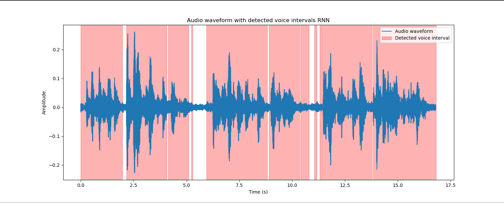
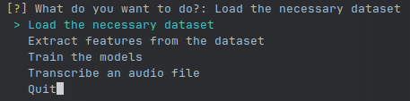
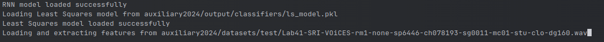
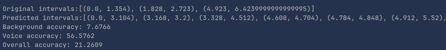

# Speech and Audio Processing (2024) - Word Segmentation and Classification using Machine Learning

## Project Overview

This project is an individual assignment for the "Speech and Audio Processing" course, offered in the 8th semester of the 2024 academic year at the University of Piraeus, Department of Informatics. The project focuses on developing a Python program that segments speech recordings into words and classifies them into background or foreground sounds using machine learning classifiers. The system must process the input audio and identify the word boundaries without any prior knowledge of the number of words.

## Course Information
- **Institution:** [University of Piraeus](https://www.unipi.gr/en/)
- **Department:** [Department of Informatics](https://cs.unipi.gr/en/)
- **Course:** Speech and Audio Processing (2024)
- **Semester:** 8th

## Technologies Used

- **Python**
- **Libraries**:
  - `TensorFlow`: For building and training neural networks.
  - `NumPy`: For numerical computations.
  - `librosa`: For audio feature extraction.
  - `pandas`: For handling datasets.
  - `inquirer`: For interactive CLI options.
  - `speechrecognition`: For basic speech processing.
  - `pydub`: For audio playback and processing.

### Classifiers Implemented

This project implements four different classifiers for segmenting and classifying the audio:
1. **Support Vector Machines (SVM)**
2. **Multilayer Perceptron (MLP)**
3. **Recurrent Neural Networks (RNN)**
4. **Least Squares**

Each classifier is trained to identify whether a portion of the audio corresponds to background noise or speech. The classifiers are trained and tested using features extracted from the audio dataset.

### Dataset Details

The **VOiCES** dataset is used for training and testing. It contains various audio samples divided into:
- **Background sound**: Contains only noise without speech.
- **Foreground sound**: Contains speech, with or without background noise.

The dataset is organized into the following structure:

```
auxiliary2024/input
├── VOiCES_devkit
    ├── distant-16k
    ├── references
    ├── source-16k
```

### Project Structure

The repository is structured as follows:

```
/source2024/
    svm.py                              # SVM classifier implementation
    mlp.py                              # MLP classifier implementation
    rnn.py                              # RNN classifier implementation
    least_squares.py                    # Least Squares classifier implementation
    main.py                             # Main script for full process execution
/docs/
    Project-description.pdf             # Description of the project
    Project-documentation.pdf           # Detailed project documentation
/images/
    program_generations.png             # Generation messages
    program_solution_exists.png         # Solution found message
    program_solution_exists_image.png   # Graph visualization
    program_start.png                   # Program start message
/auxiliary2024/
    input/                              # Contains the VOiCES dataset
    output/                             # Output directory for classifier predictions
```

Additionally:
- **`main_menu.py`**: This is located in the root directory and provides an interactive menu for selecting which part of the project to execute (e.g., dataset loading, feature extraction, model training, etc.).

## Setup Instructions

### Prerequisites

Ensure you have Anaconda or Miniconda installed on your system. You can download it from [here](https://www.anaconda.com/products/distribution).

### Running the Program

1. **Clone the repository and navigate to the project directory**:

   ```sh
   git clone https://github.com/thkox/speech-and-audio-processing
   cd speech-and-audio-processing
   ```

2. **Download the VOiCES dataset** from [here](https://registry.opendata.aws/lab41-sri-voices/).
   - Extract the dataset to the `auxiliary2024/input/` directory.

3. **Install the required libraries**:

   ```sh
   python setup.py
   ```

4. **Activate the conda environment**:

   ```sh
   conda activate speech-and-audio-processing
   ```

### Running the Classifiers

Once the environment is activated, you can execute the program using either of the following scripts:
- **`main.py`**: Executes the entire process, including loading the dataset, extracting features, training the models, and making predictions.
- **`main_menu.py`**: Opens an interactive menu where you can choose specific tasks, such as loading the dataset, extracting features, training models, and transcribing audio files.

## Example Output

Upon successful execution, the following will be displayed:

1. The progression of training and testing, along with the best classifier performances.
2. The final solution showing the word boundaries detected by the classifiers.
3. A graphical representation of the speech waveform with detected word intervals.

- **Graph Visualization**:
  
  

- **Generation Messages**:
  
  
  

- **Solution Found**:
  
  

## Project Documentation

For detailed explanations of the code, classifiers, and algorithms used in this project, refer to the `Project-documentation.pdf` located in the `/docs` directory. This document contains thorough explanations of all steps, including dataset preparation, feature extraction, model training, and evaluation.

## License

This project is licensed under the MIT License - see the [LICENSE](./LICENSE) file for details.
